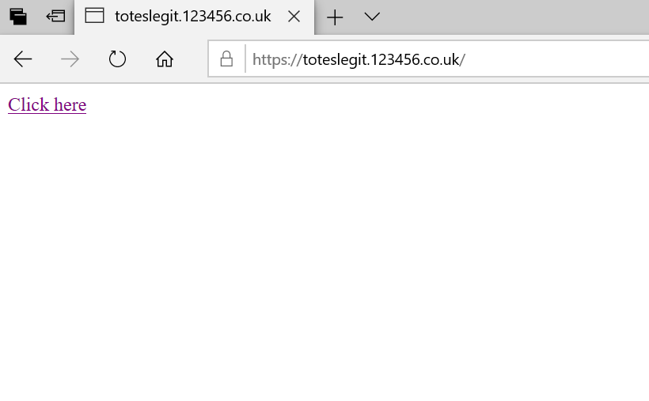
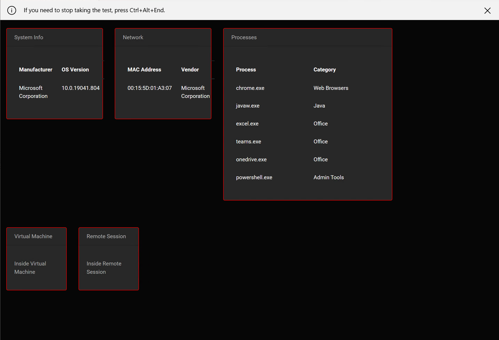

# Take a Test Windows 10 Recon

This proof of concept web app demonstrates how 'ms-edu-secureassessment' can be used to perform some enumeration of a Windows 10 endpoint by invoking some of the Take A Test API methods in JavaScript.

## Dependencies

```pip3 install flask mac_vendor_lookup```

## Usage

Configure the following lines in app.py:
```
log_file = "take_a_test.log"

protocol = "https"
server_host = "example.com"
port = 443
```
Tweak the process lists in process_lists.py to your liking and then run a sample flask server by running:
```
python3 app.py
```
However, during testing valid HTTPS/TLS was used sticking this behind a reverse proxy. Flask apps should be deployed using a WSGI (https://flask.palletsprojects.com/en/1.1.x/deploying/), however, for test purposes as this POC is intended any means should be ok.

Having run the web server browsing to the root of the site will provide an example link (assuming you ahve configured the host as above):



Clicking the link and through the warnings should show the enumerated information directly in Take a Test aswell as writing this information to the log file on the webserver:




## Author
* **David Middlehurst, MDSec ActiveBreach** - Twitter- [@dtmsecurity](https://twitter.com/dtmsecurity)

